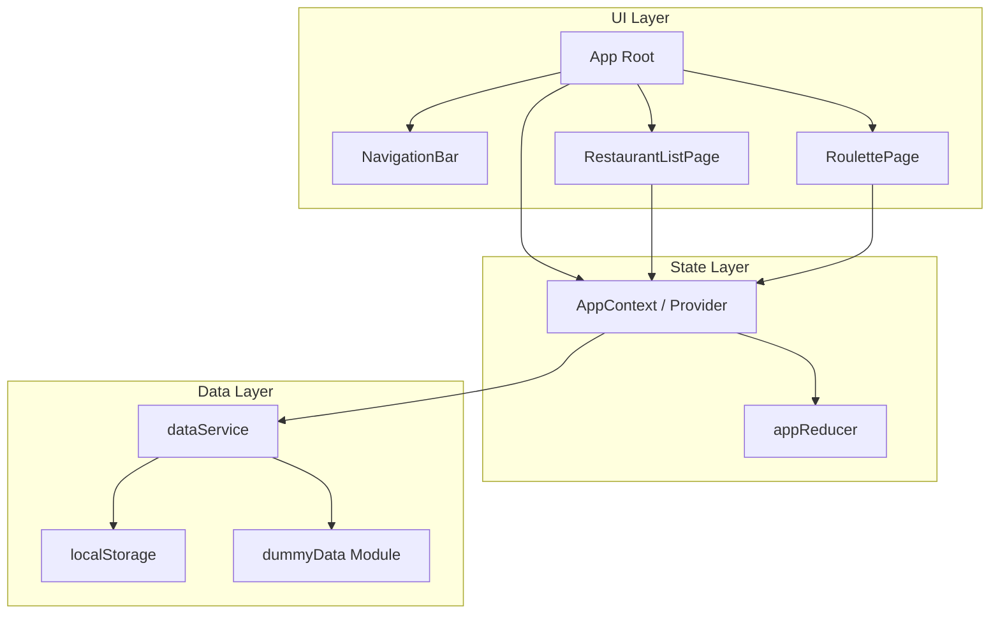
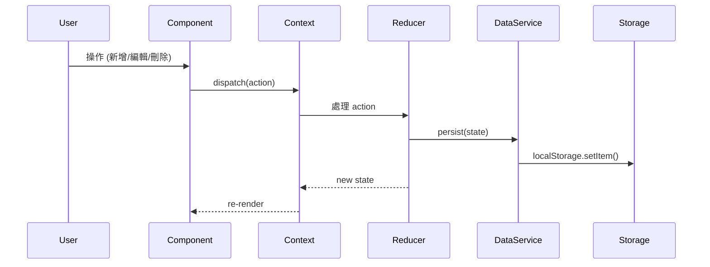
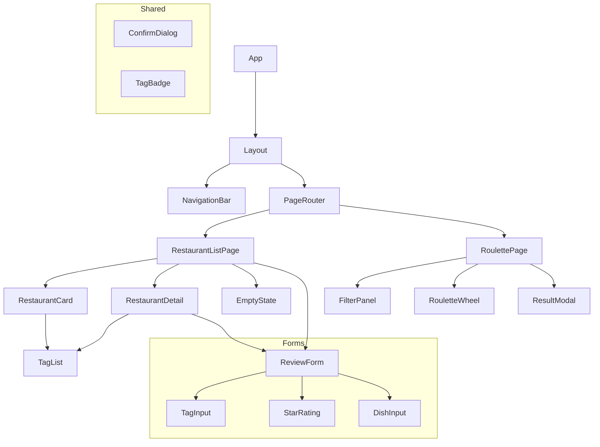
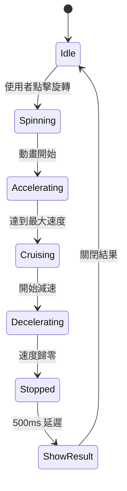

# 技術設計文件：Food Roulette

## 概述 (Overview)

Food Roulette Phase 1 是一個純前端 SPA（單頁應用程式），使用 React (Vite) + TypeScript + Tailwind CSS 建構，搭配 HTML5 Canvas 繪製動畫轉盤。此階段不涉及後端服務或外部 API，所有資料以本地狀態（React Context + localStorage）管理，並預設載入 Dummy Data 供展示使用。

### 核心設計目標

- **Phase 1 獨立性**：完全離線可用，所有功能僅依賴瀏覽器環境
- **可擴展性**：資料層抽象化，Phase 2 接入 Supabase 時只需替換資料來源模組
- **效能優先**：轉盤動畫穩定 60fps，Canvas 繪製避免不必要的重繪
- **響應式設計**：Mobile-first 設計，375px 至 1440px 全範圍適配

### Canvas vs SVG 決策

選擇 **Canvas** 作為轉盤繪製方案，理由如下：

| 面向 | Canvas | SVG |
|------|--------|-----|
| 連續旋轉動畫 | 透過 `requestAnimationFrame` 直接控制每幀，流暢度高 | 需透過 CSS transform 或 SMIL，控制粒度較低 |
| 效能 | 對連續動畫場景效能更佳，重繪整個表面計算成本低 | 每個扇區為獨立 DOM 節點，大量旋轉時可能觸發 layout |
| 緩動控制 | 可精確實作加速→勻速→減速的自定義 easing | 較難精確控制多階段緩動 |
| 文字截斷 | `measureText` API 可精確計算文字寬度進行截斷 | 需額外處理 |
| 響應式 | 透過 `devicePixelRatio` 處理高 DPI 顯示 | 原生支援向量縮放 |

綜合評估，對於需要精確控制多階段動畫、自定義 easing 函數的轉盤場景，Canvas 提供更好的控制力與效能表現。

---

## 架構 (Architecture)

### 高階架構圖



### 資料流



### 狀態管理策略

採用 **React Context + useReducer** 模式：

- **AppContext**：全域狀態容器，存放餐廳清單、Tag 列表、篩選條件
- **appReducer**：純函數處理所有狀態變更邏輯
- **dataService**：封裝 localStorage 讀寫與 Dummy Data 初始化邏輯

此設計讓 Phase 2 替換為 Supabase 時，只需修改 `dataService` 層，Context 與 Reducer 邏輯不受影響。

---

## 元件與介面 (Components and Interfaces)

### 元件樹



### 核心元件職責

| 元件 | 職責 | Props 概要 |
|------|------|-----------|
| `App` | 應用根節點，提供 Context Provider 與路由 | - |
| `NavigationBar` | 底部/頂部導航列，切換頁面 | `currentPage`, `onNavigate`, `disabled` |
| `RestaurantListPage` | 餐廳清單頁面，渲染卡片列表 | - (從 Context 取得資料) |
| `RestaurantCard` | 單張餐廳摘要卡片 | `restaurant`, `onExpand` |
| `RestaurantDetail` | 餐廳展開詳情 | `restaurant`, `onEdit`, `onDelete` |
| `ReviewForm` | 新增/編輯餐廳表單 | `mode`, `initialData?`, `onSubmit`, `onCancel` |
| `TagInput` | Tag 輸入元件（自動完成 + 新增） | `tags`, `allTags`, `onChange`, `maxTags` |
| `StarRating` | 星級評分輸入（0.5 級距） | `value`, `onChange` |
| `DishInput` | 推薦菜色多筆輸入 | `dishes`, `onChange`, `maxItems` |
| `FilterPanel` | 轉盤篩選面板 | `filters`, `onChange`, `onReset`, `candidateCount` |
| `RouletteWheel` | Canvas 轉盤元件 | `candidates`, `onSpinEnd`, `isSpinning` |
| `ResultModal` | 結果彈窗 | `restaurant`, `onClose`, `onSpinAgain` |
| `ConfirmDialog` | 通用確認對話框 | `title`, `message`, `onConfirm`, `onCancel` |
| `EmptyState` | 空狀態引導 | `message`, `actionLabel`, `onAction` |

### 關鍵介面定義

```typescript
// RouletteWheel 元件介面
interface RouletteWheelProps {
  candidates: Restaurant[];
  onSpinEnd: (selected: Restaurant) => void;
  isSpinning: boolean;
  onSpinStart: () => void;
}

// FilterPanel 元件介面
interface FilterPanelProps {
  filters: FilterState;
  onChange: (filters: FilterState) => void;
  onReset: () => void;
  candidateCount: number;
  allTags: Tag[];
}

// ReviewForm 元件介面
interface ReviewFormProps {
  mode: 'create' | 'edit';
  initialData?: Partial<Restaurant>;
  onSubmit: (data: RestaurantFormData) => void;
  onCancel: () => void;
  allTags: Tag[];
}
```

---

## 資料模型 (Data Models)

### TypeScript 型別定義

```typescript
// === 核心實體 ===

type RestaurantStatus = 'WISH_LIST' | 'VISITED';

type BudgetLevel = '$' | '$$' | '$$$';

interface Tag {
  id: string;        // UUID v4
  name: string;      // 1-20 字元，去除前後空白
}

interface Restaurant {
  id: string;                    // UUID v4
  name: string;                  // 1-100 字元，必填
  status: RestaurantStatus;
  rating: number | null;         // 1.0-5.0，0.5 級距；WISH_LIST 時為 null
  avgCost: number | null;        // 正整數，最大 99999；WISH_LIST 時為 null
  budgetLevel: BudgetLevel | null; // 由 avgCost 衍生或手動設定
  recommendedDishes: string[];   // 每筆最多 50 字元，最多 10 筆
  notes: string;                 // 最多 500 字元
  tagIds: string[];              // 最多 10 個 Tag ID
  createdAt: string;             // ISO 8601 timestamp
  updatedAt: string;             // ISO 8601 timestamp
}

// === 表單相關 ===

interface RestaurantFormData {
  name: string;
  status: RestaurantStatus;
  rating: number | null;
  avgCost: number | null;
  recommendedDishes: string[];
  notes: string;
  tagIds: string[];
}

// === 篩選狀態 ===

type StatusFilter = 'ALL' | 'WISH_LIST' | 'VISITED';
type BudgetFilter = 'ALL' | '$' | '$$' | '$$$';

interface FilterState {
  status: StatusFilter;
  budget: BudgetFilter;
  selectedTagIds: string[];
}

const DEFAULT_FILTER: FilterState = {
  status: 'ALL',
  budget: 'ALL',
  selectedTagIds: [],
};

// === 全域狀態 ===

interface AppState {
  restaurants: Restaurant[];
  tags: Tag[];
  filters: FilterState;
  currentPage: 'list' | 'roulette';
  ui: {
    isFormOpen: boolean;
    editingRestaurantId: string | null;
    expandedCardId: string | null;
    isSpinning: boolean;
    resultRestaurantId: string | null;
    scrollPosition: number;
  };
}

// === Action Types ===

type AppAction =
  | { type: 'ADD_RESTAURANT'; payload: RestaurantFormData }
  | { type: 'UPDATE_RESTAURANT'; payload: { id: string; data: RestaurantFormData } }
  | { type: 'DELETE_RESTAURANT'; payload: { id: string } }
  | { type: 'ADD_TAG'; payload: { name: string } }
  | { type: 'SET_FILTERS'; payload: Partial<FilterState> }
  | { type: 'RESET_FILTERS' }
  | { type: 'NAVIGATE'; payload: { page: 'list' | 'roulette' } }
  | { type: 'SET_UI'; payload: Partial<AppState['ui']> }
  | { type: 'LOAD_DATA'; payload: { restaurants: Restaurant[]; tags: Tag[] } };
```

### 預算等級對應規則

```typescript
function deriveBudgetLevel(avgCost: number | null): BudgetLevel | null {
  if (avgCost === null) return null;
  if (avgCost <= 200) return '$';
  if (avgCost <= 600) return '$$';
  return '$$$';
}
```

### localStorage 結構

```typescript
interface StorageSchema {
  'food-roulette:restaurants': Restaurant[];
  'food-roulette:tags': Tag[];
  'food-roulette:initialized': boolean; // 標記是否已初始化
}
```

### 篩選邏輯

```typescript
function filterCandidates(
  restaurants: Restaurant[],
  filters: FilterState
): Restaurant[] {
  return restaurants.filter(r => {
    // 狀態篩選
    if (filters.status !== 'ALL' && r.status !== filters.status) return false;
    // 預算篩選
    if (filters.budget !== 'ALL' && r.budgetLevel !== filters.budget) return false;
    // Tag 篩選（至少符合一個選中的 Tag）
    if (filters.selectedTagIds.length > 0) {
      const hasMatchingTag = filters.selectedTagIds.some(tagId => 
        r.tagIds.includes(tagId)
      );
      if (!hasMatchingTag) return false;
    }
    return true;
  });
}
```

---

## 轉盤動畫實作細節

### 動畫流程



### 核心演算法

```typescript
interface SpinConfig {
  minDuration: number;  // 最短 3 秒
  maxDuration: number;  // 最長 6 秒
  minRotations: number; // 最少旋轉圈數 (如 5 圈)
}

// 隨機決定目標角度（確保均等機率）
function calculateTargetAngle(
  candidateCount: number,
  config: SpinConfig
): { targetAngle: number; selectedIndex: number } {
  const selectedIndex = Math.floor(Math.random() * candidateCount);
  const sectorAngle = (2 * Math.PI) / candidateCount;
  // 目標落在選中扇區的隨機位置
  const sectorOffset = Math.random() * sectorAngle;
  const baseAngle = selectedIndex * sectorAngle + sectorOffset;
  // 加上多圈旋轉
  const rotations = config.minRotations + Math.floor(Math.random() * 3);
  const targetAngle = rotations * 2 * Math.PI + baseAngle;
  return { targetAngle, selectedIndex };
}

// Easing 函數：cubic ease-out 模擬減速
function easeOutCubic(t: number): number {
  return 1 - Math.pow(1 - t, 3);
}
```

### Canvas 繪製策略

- 使用 `devicePixelRatio` 處理高 DPI 螢幕
- 每幀只需更新旋轉角度，不需重新計算扇區幾何
- 文字超過 6 字元時使用 `ctx.measureText()` 進行截斷 + 省略號
- 指針固定繪製在 Canvas 上方，不隨轉盤旋轉

---

## 檔案結構

```
src/
├── main.tsx                     # 應用進入點
├── App.tsx                      # 根元件，Provider 配置
├── components/
│   ├── layout/
│   │   ├── Layout.tsx           # 主要佈局框架
│   │   └── NavigationBar.tsx    # 導航列
│   ├── restaurant/
│   │   ├── RestaurantCard.tsx   # 餐廳卡片
│   │   ├── RestaurantDetail.tsx # 餐廳詳情展開
│   │   ├── RestaurantListPage.tsx # 清單頁面
│   │   └── EmptyState.tsx       # 空狀態提示
│   ├── form/
│   │   ├── ReviewForm.tsx       # 新增/編輯表單
│   │   ├── TagInput.tsx         # Tag 輸入
│   │   ├── StarRating.tsx       # 星級評分
│   │   └── DishInput.tsx        # 推薦菜色輸入
│   ├── roulette/
│   │   ├── RoulettePage.tsx     # 轉盤頁面
│   │   ├── RouletteWheel.tsx    # Canvas 轉盤
│   │   ├── FilterPanel.tsx      # 篩選面板
│   │   └── ResultModal.tsx      # 結果彈窗
│   └── shared/
│       ├── ConfirmDialog.tsx    # 確認對話框
│       ├── TagBadge.tsx         # Tag 標籤樣式
│       └── TagList.tsx          # Tag 列表（含收合）
├── context/
│   ├── AppContext.tsx           # Context 定義與 Provider
│   └── appReducer.ts           # Reducer 邏輯
├── services/
│   └── dataService.ts          # localStorage 讀寫封裝
├── data/
│   └── dummyData.ts            # Dummy Data 獨立模組
├── hooks/
│   ├── useRouletteWheel.ts     # 轉盤動畫邏輯 hook
│   └── useLocalStorage.ts      # localStorage hook
├── types/
│   └── index.ts                # 所有 TypeScript 型別定義
├── utils/
│   ├── filterUtils.ts          # 篩選邏輯工具函數
│   ├── validationUtils.ts      # 表單驗證工具函數
│   └── formatUtils.ts          # 格式化工具（金額、文字截斷等）
└── styles/
    └── index.css               # Tailwind 進入點
```

---

## 正確性屬性 (Correctness Properties)

*屬性（Property）是在系統所有合法執行中都應保持為真的特徵或行為——本質上是對系統行為的形式化陳述。屬性作為人類可讀規格與機器可驗證正確性保證之間的橋樑。*

以下屬性基於需求文件中的驗收標準，經過 PBT 適用性分析與去重整合後得出。每個屬性皆可透過 property-based testing 框架（如 fast-check）自動驗證。

### Property 1: 篩選邏輯正確性（AND 組合）

*對於任何* 餐廳清單與任意篩選條件組合（狀態、預算、Tag），篩選結果中的每間餐廳必定同時滿足所有啟用的篩選條件：狀態匹配、預算等級匹配、且至少包含一個選中的 Tag（當有選取 Tag 時）。

**Validates: Requirements 5.2, 5.3**

### Property 2: WISH_LIST 欄位隱藏不變量

*對於任何* Status 為 WISH_LIST 的餐廳，其 `rating` 應為 null、`avgCost` 應為 null、`recommendedDishes` 應為空陣列。此規則在餐廳卡片、詳情展開、結果彈窗及表單中皆適用。

**Validates: Requirements 1.5, 2.5, 7.2**

### Property 3: Tag 顯示截斷規則

*對於任何* 擁有 N 個 Tag 的餐廳（N > 5），卡片上顯示的 Tag 數量應恰好為 5 個，並附帶 "+{N-5}" 的剩餘數量提示。若 N ≤ 5，則顯示所有 Tag 且無剩餘提示。

**Validates: Requirements 1.2, 4.6**

### Property 4: 餐廳名稱空白驗證

*對於任何* 僅由空白字元（空格、Tab、換行等）組成的字串或空字串，表單驗證應拒絕提交並回傳錯誤，餐廳清單不應發生變化。

**Validates: Requirements 2.4**

### Property 5: Tag 驗證規則

*對於任何* Tag 名稱字串，去除前後空白後：(a) 長度小於 1 或大於 20 時應被拒絕；(b) 完全為空白時應被拒絕；(c) 與該餐廳現有 Tag 名稱完全相同時應被拒絕；(d) 當餐廳已有 10 個 Tag 時應阻止新增。

**Validates: Requirements 4.1, 4.2, 4.3**

### Property 6: 新增餐廳增長清單

*對於任何* 合法的餐廳表單資料與現有清單，新增操作後清單長度應增加 1，且新清單中應包含一筆名稱匹配的餐廳。

**Validates: Requirements 2.3**

### Property 7: 刪除餐廳縮減清單

*對於任何* 清單中存在的餐廳，刪除後清單長度應減少 1，且該餐廳 ID 應不再存在於清單中。

**Validates: Requirements 3.5**

### Property 8: 編輯資料往返一致性

*對於任何* 現有餐廳，將其資料填入表單再提交（不做任何修改），更新後的餐廳資料應與原始資料完全一致（除 `updatedAt` 欄位外）。

**Validates: Requirements 3.1, 3.2**

### Property 9: 狀態轉換欄位清除

*對於任何* Status 為 VISITED 且具有評分、消費金額、推薦菜色的餐廳，當 Status 變更為 WISH_LIST 時，`rating` 應被設為 null、`avgCost` 應被設為 null、`recommendedDishes` 應被清為空陣列。

**Validates: Requirements 3.3**

### Property 10: Tag 移除局部性

*對於任何* 餐廳及其任意一個已附加的 Tag，移除該 Tag 後：(a) 餐廳的 tagIds 長度減少 1；(b) 全域 Tag 列表中該 Tag 仍然存在且數量不變。

**Validates: Requirements 4.4**

### Property 11: Tag 去重複使用

*對於任何* 與全域 Tag 列表中既有項目名稱完全相同的新 Tag 輸入，操作完成後全域 Tag 列表長度不應增加（重複使用既有 Tag）。

**Validates: Requirements 4.5**

### Property 12: 清單排序不變量

*對於任何* 餐廳清單，呈現時的順序應滿足：對所有相鄰元素 (i, i+1)，`restaurants[i].createdAt >= restaurants[i+1].createdAt`（由新到舊）。

**Validates: Requirements 1.1**

### Property 13: 轉盤選擇均勻性

*對於任何* N 個候選餐廳（2 ≤ N ≤ 20），選擇函數產生的索引應在 [0, N-1] 範圍內均勻分佈（經大量取樣後，每個索引的出現頻率接近 1/N）。

**Validates: Requirements 6.2**

### Property 14: 文字截斷規則

*對於任何* 字串，若長度超過 6 個字元，截斷函數應回傳最多 6 個字元加上 "..." 的結果；若長度 ≤ 6 個字元，應原封不動回傳。

**Validates: Requirements 6.5**

---

## 錯誤處理 (Error Handling)

### 表單驗證錯誤

| 錯誤情境 | 處理方式 |
|----------|---------|
| 餐廳名稱為空/僅空白 | 欄位下方顯示紅色錯誤訊息「餐廳名稱為必填」，阻止提交 |
| 餐廳名稱超過 100 字元 | 欄位下方顯示「名稱不可超過 100 字」，阻止提交 |
| 評分不在 1.0-5.0 範圍 | 限制 UI 輸入範圍，無法輸入非法值 |
| 平均消費非正整數或超過 99999 | 欄位下方顯示「請輸入有效金額」 |
| 推薦菜色超過 50 字元 | 欄位下方顯示「每道菜名最多 50 字」 |
| 推薦菜色超過 10 筆 | 隱藏新增按鈕，顯示「最多新增 10 道」 |
| 個人筆記超過 500 字元 | 顯示剩餘字數，超出時標紅並阻止提交 |
| Tag 名稱空白/超過 20 字 | 輸入框下方即時顯示驗證提示 |
| Tag 已存在於餐廳 | 顯示「此標籤已存在」 |
| Tag 數量達到 10 上限 | 隱藏輸入框或顯示「已達標籤上限」 |

### 資料持久化錯誤

| 錯誤情境 | 處理方式 |
|----------|---------|
| localStorage 空間不足 | 捕獲 `QuotaExceededError`，顯示提示訊息建議清除部分資料 |
| localStorage 資料損毀 | `JSON.parse` 失敗時，自動重新載入 Dummy Data 並提示使用者 |
| 資料格式版本不相容 | 預留版本號欄位，未來做資料遷移用 |

### 轉盤相關錯誤

| 錯誤情境 | 處理方式 |
|----------|---------|
| 候選餐廳為 0 | 禁用旋轉按鈕，顯示「無符合條件的餐廳」 |
| 候選餐廳為 1 | 跳過動畫直接顯示結果 |
| Canvas 不支援 | 降級提示訊息（極少見於現代瀏覽器） |
| 動畫中途元件卸載 | `useEffect` cleanup 取消 `requestAnimationFrame` |

### 通用錯誤處理原則

- 所有使用者可見的錯誤訊息使用繁體中文
- 表單驗證採用「失焦驗證 + 提交驗證」雙重機制
- 非阻塞性錯誤使用 toast 提示，3 秒後自動消失
- 阻塞性錯誤（如表單驗證）直接在欄位旁顯示

---

## 測試策略 (Testing Strategy)

### 測試框架選擇

- **單元測試 / 整合測試**：Vitest（與 Vite 原生整合）
- **Property-Based Testing**：fast-check（JavaScript/TypeScript 生態系最成熟的 PBT 框架）
- **元件測試**：React Testing Library + Vitest
- **E2E 測試**：Playwright（Phase 1 後期視需求加入）

### 測試分層

```
┌─────────────────────────────────────┐
│         E2E Tests (Playwright)       │  ← 少量，驗證關鍵使用者流程
├─────────────────────────────────────┤
│    Integration Tests (RTL + Vitest)  │  ← 元件互動、Context 整合
├─────────────────────────────────────┤
│     Property Tests (fast-check)      │  ← 驗證核心邏輯的通用正確性
├─────────────────────────────────────┤
│       Unit Tests (Vitest)            │  ← 工具函數、reducer 邏輯
└─────────────────────────────────────┘
```

### Property-Based Testing 配置

- 框架：**fast-check** (`fc.assert` + `fc.property`)
- 每個屬性測試最少執行 **100 次迭代**
- 每個 property test 須以註解標示對應的設計屬性：
  ```typescript
  // Feature: food-roulette, Property 1: 篩選邏輯正確性
  ```
- Tag 格式：**Feature: food-roulette, Property {number}: {property_text}**

### 適用 PBT 的測試目標

| Property # | 測試目標函數/模組 | Generator 策略 |
|-----------|-----------------|---------------|
| 1 | `filterCandidates()` | 隨機餐廳陣列 + 隨機 FilterState |
| 2 | `appReducer` (ADD/UPDATE) + display logic | 隨機 Restaurant with status=WISH_LIST |
| 3 | `formatTagList()` | 隨機長度 Tag 陣列 (0-15) |
| 4 | `validateRestaurantName()` | `fc.string()` filtered to whitespace-only |
| 5 | `validateTagName()` | 隨機字串 + 既有 Tag 列表 |
| 6 | `appReducer` (ADD_RESTAURANT) | 合法 RestaurantFormData |
| 7 | `appReducer` (DELETE_RESTAURANT) | 隨機清單 + 隨機選取目標 |
| 8 | `formDataFromRestaurant()` → `restaurantFromFormData()` | 隨機 Restaurant |
| 9 | `appReducer` (UPDATE with status change) | VISITED restaurant → WISH_LIST |
| 10 | `removeTagFromRestaurant()` | 隨機餐廳 + 隨機 Tag |
| 11 | `addTagToRestaurant()` | 重複 Tag 名稱 |
| 12 | `sortByCreatedAt()` | 隨機時間戳陣列 |
| 13 | `selectRandomCandidate()` | 隨機 N (2-20)，統計分佈驗證 |
| 14 | `truncateText()` | `fc.string()` 任意長度 |

### 單元測試覆蓋目標

- 工具函數（formatUtils, validationUtils, filterUtils）：100% 覆蓋
- Reducer 邏輯：所有 action type 覆蓋
- 資料服務（dataService）：初始化、讀取、寫入場景

### 整合測試重點

- ReviewForm 提交流程（新增 + 編輯）
- 篩選條件變更 → 候選數量更新
- 導航切換保留狀態
- Modal 開啟/關閉行為

### 不適用 PBT 的項目

以下項目使用 example-based 測試或視覺測試：

- 響應式佈局（需求 8）→ Playwright viewport 測試
- 動畫時間控制（6.4）→ Timer mock + example test
- UI 交互（展開/收合、導航切換）→ RTL event simulation
- Dummy Data 結構驗證（需求 10）→ Smoke test 確認資料結構正確
